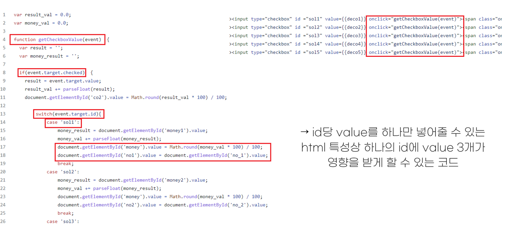

# **기업요구사항 기반의 문제해결프로젝트**

## **프로젝트 조직**(구성원 및 역할)

팀명 : **가디언즈(Guardians)**

PM : 임태혁

조원 : [Front-End] 노청명, 신채원	

​		   [Back-End] 복정훈, 최솔비

## 프로젝트 정보

### 1. 프로젝트 주제 및 시연 영상

**탄소 중립 2050 달성을 위한 기업 단위의 머신러닝 탄소배출량 예측 및 가이드 제공**

https://youtu.be/5QxsLW_1Uqw

### 2. 주제 선정배경 또는 이유

최근 (2020 12월) 정부는 탄소 중립 2025라는 주제로 장기저탄소발전전략을 통해 2050 탄소중립 비전을 선언했고,  탄소중립을 달성해 나가기 위한 법정 절차와 정책수단을 발의하였다. 탄소배출에 관한 글로벌 규제와 선진국들의 탄소국경조정세 제도는 각국의 참여를 강제할 뿐만 아니라 막대한 청구서를 요구한다. 따라서 국내 탄소배출량을 예측하고 각 기업들의 탄소배출량을 감축하는 것이 어느때보다 중요해졌으며, 이를 쉽고 간편하게 다가갈 수 있게하여 기업의 참여를 유도하고 대한민국의 탄소중립 달성에 기여하고자 한다.  

### 3. 프로젝트 개요

본 프로젝트는 기업내부의 실무자들이 온실가스 배출에 대한 자사의 현황을 인지하고 절감하기 위하여 머신러닝 분석을 통한 기술 추천과 탄소 배출량 시계열 분석 서비스를 제공한다.

​																															[프로젝트 도식화]

​																														[웹페이지 도식화]

### 4. 프로젝트 환경 및 사용된 툴

| 언어        | 통합 개발 환경            | 시각화                                            | 분석 라이브러리                   | 웹 구현 | 웹 클라이언트        |
| ----------- | ------------------------- | ------------------------------------------------- | --------------------------------- | ------- | -------------------- |
| Python 3.6.4, SQL | Pycharm, Jupyter Notebook | Tableau, Matplotlib, Plotly, Flourish, High Chart | Pandas, Numpy, Sikit-Learn, ARIMA | Django  | HTML5, JS, Ajax, CSS |

| 시스템 운영 환경 | 데이터베이스 | 협업 도구                            |
| ---------------- | ------------ | ------------------------------------ |
| Goorm            | SQLite       | Github, Zoom, Google Docs, Kakaotalk |

### 5. 데이터 출처

| 데이터                                                       | 사이트           | 링크                                                         |
| ------------------------------------------------------------ | ---------------- | ------------------------------------------------------------ |
| 사업장별 온실가스 배출량/에너지 사용량 정보                  | Envbigdata       | https://www.bigdata-environment.kr/user/data_market/detail.do?id=56f03d80-f36a-11eb-b976-6966248a20b9 |
| 에너지 온실가스 감축 기술 정보                               | Envbigdata       | https://www.bigdata-environment.kr/user/data_market/detail.do?id=6ecb2ce0-03d1-11ec-82b9-3debd40f3738 |
| 한국지역난방공사 온실가스 배출량 정보 & 열생산량/열판매랑/전기판매량/공급현황정보 | 공공 데이터 포털 | https://www.data.go.kr/tcs/dss/selectApiDataDetailView.do?publicDataPk=15002810 |

## 웹페이지 구성 및 설명

- ### Home

  1. 탄소 국경세 관련영상

     -사용자의 탄소배출과 탄소세등 탄소관련 주제에대한 이해를 돕고 프로젝트의 방향에 대하여 환기하기 위해 관련 영상 첨부

  2. 국가별 탄소 배출량

     -국가별 탄소 배출량을 Flourish를 통하여 애니메이션화 하여 1990 ~ 2020까지 한눈에 볼 수 있도록 시각화하였으며, 대한민국의 순위 변화및 심각성을 인지 할 수 있도록 구성

  3. 기상청 기온데이터

     기상청 기온데이토를 활용하여 ARIMA 시계열 분석 및 시각화 하여 미래 기온의 상승에 대하여 알아보고 심각성을 인지하고 해결하고자 하는 의식을 고취하기 위함

- ### 지역별 온실가스

  

  -Tableau를 통하여 지역별로 온실가스 배출량, 업종별 분포도, 연도별 온실가스 배출량등 다양한 데이터를 한눈에 확인할 수 있음

- ### 온실가스 뉴스 정보

  

  -온실가스 관련 트렌드 및 추세 파악을 위하여 연도별 온실가스에 대한 뉴스량과 연관 키워드를 한눈에 볼 수 있도롤 Tableau를 통하여 시각화 하였으며, 사이드에 최신 뉴스를 시간마다 받아와서 출력함

- ### 기업별온실가스

  

  -현재 산업군 별로 탄소 배출량이 어떻게 이루어져있는지 한눈에 파악이 가능하며, 세부적으로 기업단위로 탄소 배출량 검색 및 해당 기업 또는 검색한 본인의 기업이 해당 산업군에서 어느 위치에 위치하였는지 파악 가능하도록 구성

  -사이드에 실시간으로 배출권 시세를 조회하고, 탄소와 관련된 법령을 조회할 수 있도록 구성하여, 사용자의 이해를 도움

- ### 기업별 환경데이터

  

  -본인의 기업 및 알아보고 싶은 기업을 산업군 별로 조회하여 해당 산업군 내의 본인의 위치가 어느정도인지, 또한 정확한 에너지 사용량은 어느정도인지 파악이 가능 

- ### 머신러닝 탄소감축 가이드

  #### 1. 감축가이드 1번째 탭(기본 정보 입력)

  

  1. 첫번째 페이지에서 본인의 기업에 맞는 정보(지역,업종,주력 에너지원, 절감기술 우선순위,전력사용량등)을 입력할 수 있음

  2. 입력된 전력 사용량을 통하여 해당 기업의 탄소 발생량과 해당 탄소를 감축하기 위한 소나무의 양을 확인할 수 있음

  #### 2. 감축가이드 2번째 탭(기업에 맞는 감축 기술 추천)

1. 추천된 기술중 본인이 실현 가능하거나 실천중인 기술 체크
2. 체크된 기술의 감축량과 감축액을 자동으로 더하여 출력
3. 앞서 입력된 값과 해당직군의 평균값을 비교할 수 있는 그래프탭

 #### 3. 감축가이드 3번째 탭(분석결과)

1. (탄소 배출 비교 탭) 기존 입력된 데이터를 활용한 ARIMA 예측 시각화 추후 발생량의 예측량을 확인할 수 있음

2. (과거+예측치 시각화) 앞서 적용한 감축기술을 적용 하였을때의 예측 머신러닝 결과 시각화

3. (감축 적용치 비교) 해당 업종의 평균 배출량과 본인 기업의 배출량, 기술적용시 배출량, 정부기대치를 비교해서 그래프로 볼 수 있음

4. (세부 솔루션) 감축 기술에 대한 세부 솔루션을 택스트로 정리하여 한눈에 볼 수 있음

5. 세부기술 알아보기를 통하여 보충하여 더 알아보고 싶은 부분이나 세부적인 정보를 확인할 수 있음

   

## 프로젝트 코드 설명

#### - Arima 시계열 분석

#### - Tableau 전처리

- 지역및 기업의 온실가스 정보 Tableau 시각화 전처리
  - 세분화된 업종을 그래프로 한눈에 확인할 수 있도록 10개항목으로 추려서 간소화 하는 작업 진행 또한 주소도 통합할 수 있도록 시,도별로 묶음

- 뉴스 Tableau 시각화 관련 전처리

  - 단어가 한 줄로 이어진 뉴스 데이터를 형태소단위로 잘라서 단어의 빈도를 카운트 하여 워드클라우드 및 키워드 검색에 활용하였다.

#### - 업종별 기술 방안 추천 코드

- 입력값이 너무 작을경우 감축기술의 감소량과 연관되어 추천되는 추천기술의 특성 상 오류가 발생 이를 Try Exept문을 활용하여 예외처리하여 정상작동할 수 있도록 구성

#### - 감축기술 체크박스 실시간 변화

- ID당 value값을 하나만 입력할 수 있는 HTML의 특성을 function문을 활용하여 value 3개에 영향을 받을수 있도록 온클릭 이벤트문을 활용하여 실시간 인풋탭 구성

